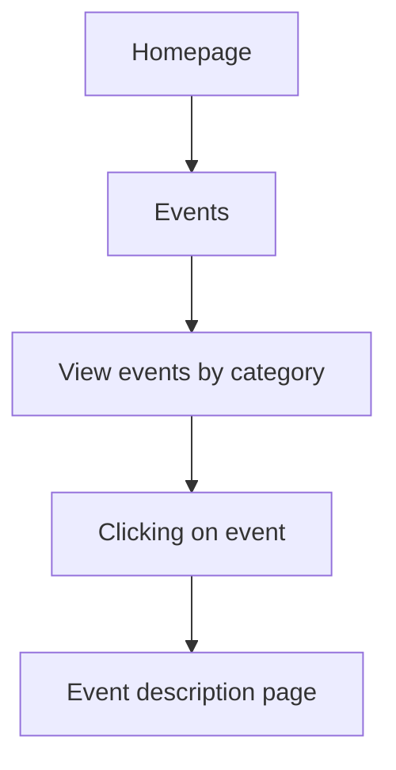

### Feature: Display Event
- **Description**: A section of the homepage that displays the lists of events separated by categories. Clicking on each event will lead to the event description page.

```mermaid
graph TD;
  A[Homepage]-->B[Events]
  B[Events]-->C[View events by category]
  C[View events by category]-->D[Clicking on event]
  D[Clicking on event]-->E[Event description page]
```