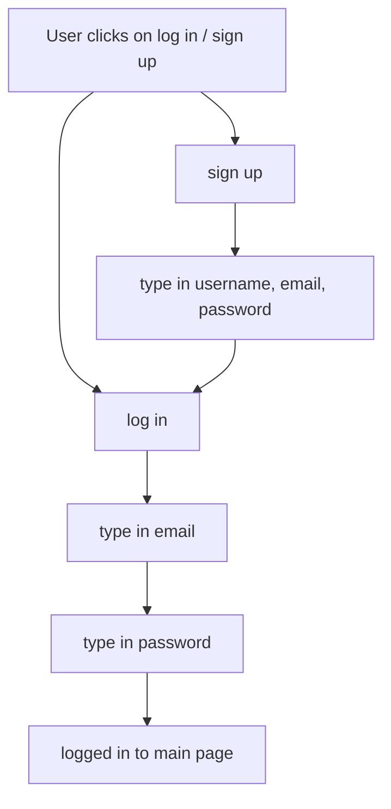

### Feature: login page:
- **Description**: A log in page that allow user to log in or create account. 

```mermaid
graph TD;
    A[User clicks on log in / sign up] --> B[log in];
    B[log in] --> C[type in email];
    C[type in email] --> D[type in password];
    D[type in password] --> E[logged in to main page];
    A[User clicks on log in / sign up] --> F[sign up];
    F[sign up] --> G[type in username, email, password];
    G[type in username, email, password] --> B[log in];
```
