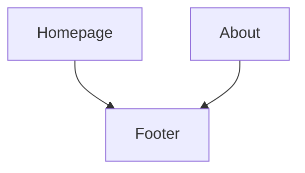
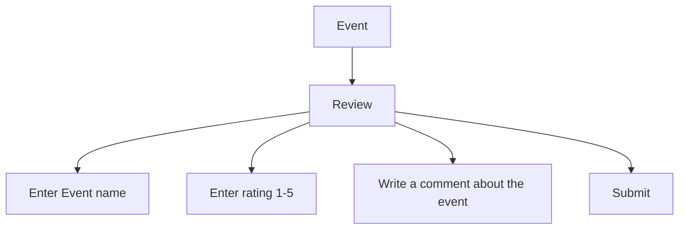

### Feature: Footer
- **Description**: A footnote at the bottom of every page to provide supplementary information about the group and the members that contributed to the website.

### Feature: Review page
- **Description**: A review page where users can leave a review for an event by pressing a button to access the review page. The review page allows users to rate the event from 1 to 5 and write a comment about the event.

