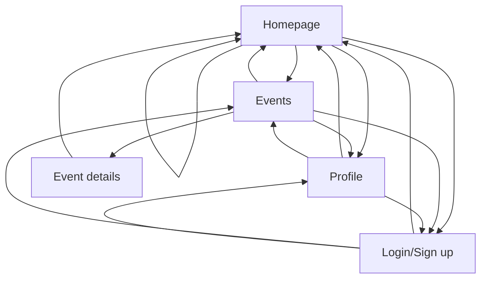
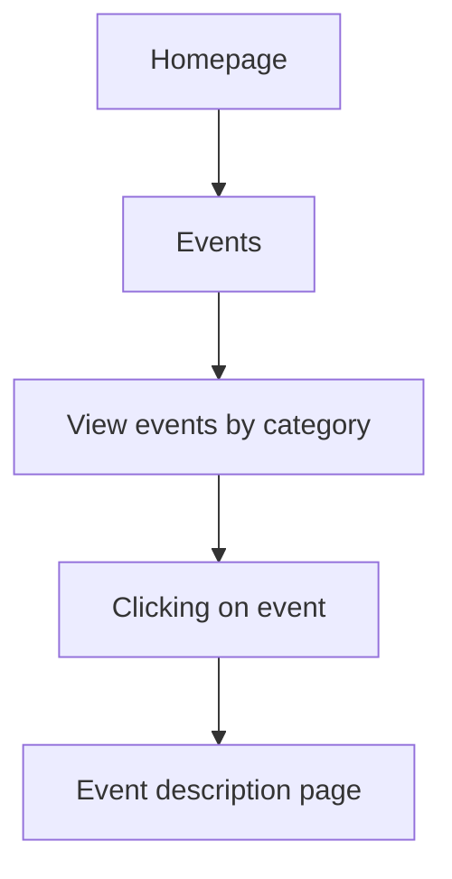
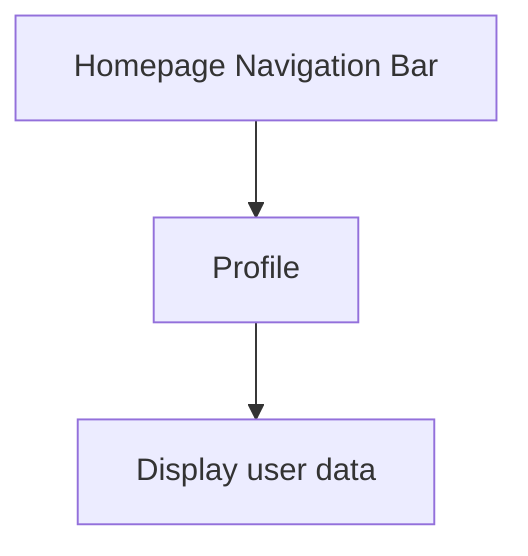

### Feature: Navigation Bar:
- **Description**: A navigation tab above the page that allow users to navigate between pages (homepage, events, profiles, event details, and login/sign up page).

### Feature: Display Event
- **Description**: A section of the homepage that displays the lists of events separated by categories. Clicking on each event will lead to the event description page.

### Feature: Profile Page
- **Description**: A page that displays the user's information such as profile picture, name, phone number, email, age, and biography.

