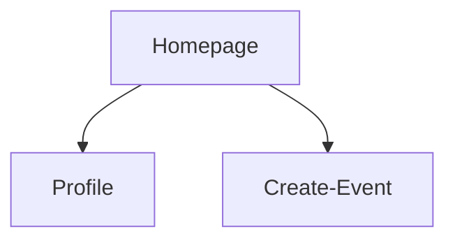
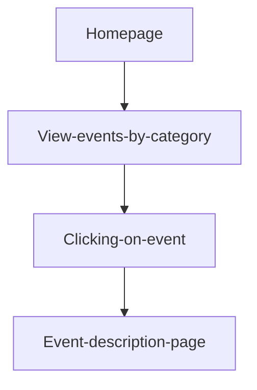

### Feature: Navigation Bar:
- **Description**: A navigation tab above the page that allow users to navigate between pages (homepage, create events, and profiles).

### Feature: Display Event
- **Description**: A section of the homepage that displays the lists of events separated by categories.

