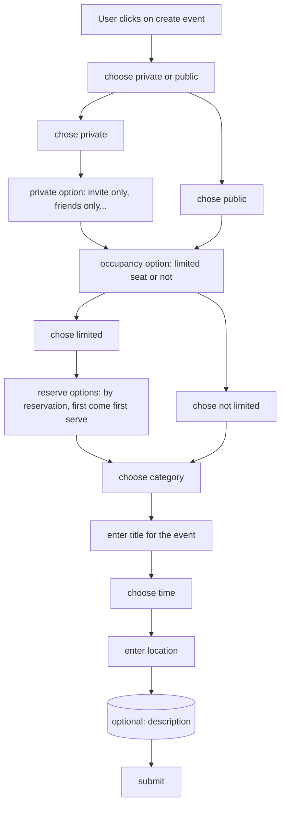

### Feature: create event:
- **Description**: A create event function that allow user to publish a event for other to join. 

```mermaid
graph TD;
    A[User clicks on create event] --> B[choose: private or public];
    B[choose private or public] --> C[chose private];
    B[choose private or public] --> D[chose public];
    C[chose private] --> E[private options: invite only, friends only...];
    E[private option: invite only, friends only...] --> F[occupancy options: limited seat or not];
    D[chose public] --> F[occupancy options: limited seat or not];
    F[occupancy option: limited seat or not] --> G[chose limited];
    G[chose limited] --> H[reserve options: by reservation, first come first serve];
    F[occupancy option: limited seat or not] --> I[chose not limited];
    H[reserve options: by reservation, first come first serve] --> J[choose category];
    I[chose not limited] --> J[choose category];
    J[choose category] --> K[enter title for the event];
    K[enter title for the event] --> L[choose time];
    L[choose time] --> M[enter location];
    M[enter location] --> N[(optional: description)];
    N[(optional: description)] --> O[submit];
```
