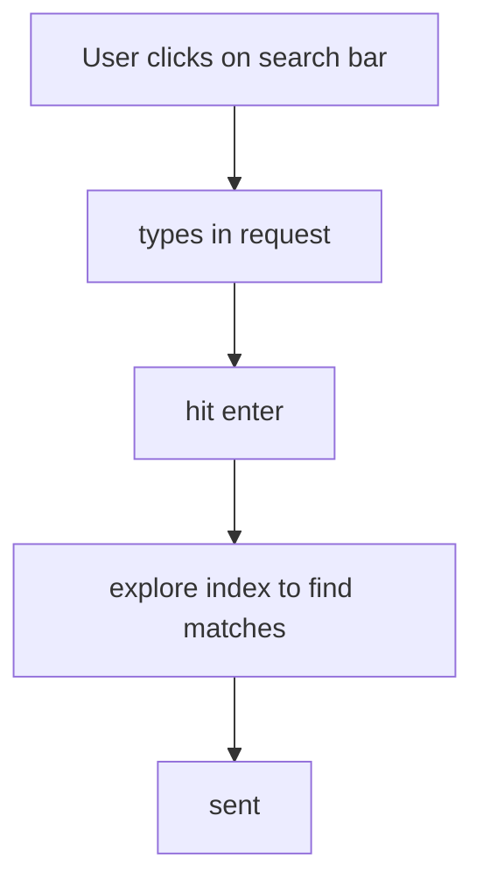

```mermaid
graph TD;
    A[User clicks on search bar] --> B[types in request];
    B[types in request] --> C[hit enter];
    C[hit enter] --> D[explore index to find matches]
    D[explore index to find matches] --> E[sent]
```
