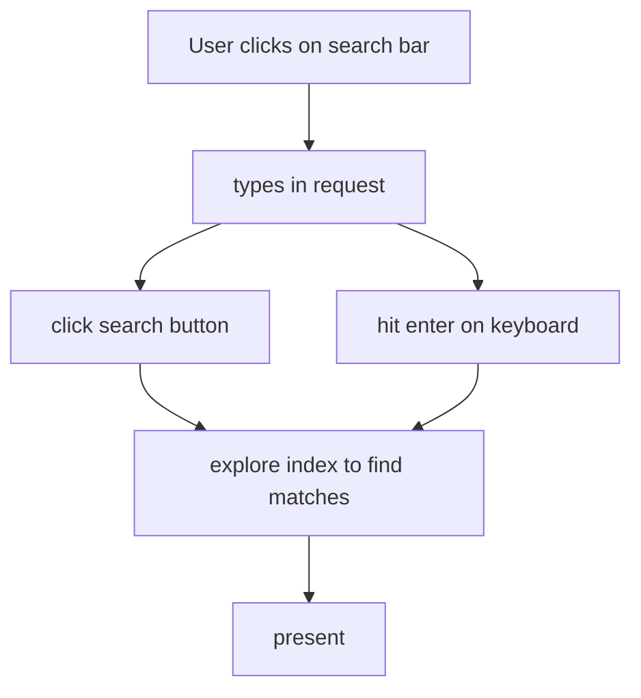

### Feature: Search Bar:
- **Description**: A search bar that allows users to look for speciifc events.

```mermaid
graph TD;
    A[User clicks on search bar] --> B[types in request];
    B[types in request] --> C[hit enter on keyboard];
    B[types in request] --> D[click search button];
    D[click search button] --> E[explore index to find matches];
    C[hit enter on keyboard] --> E[explore index to find matches];
    E[explore index to find matches] --> F[present];
```
