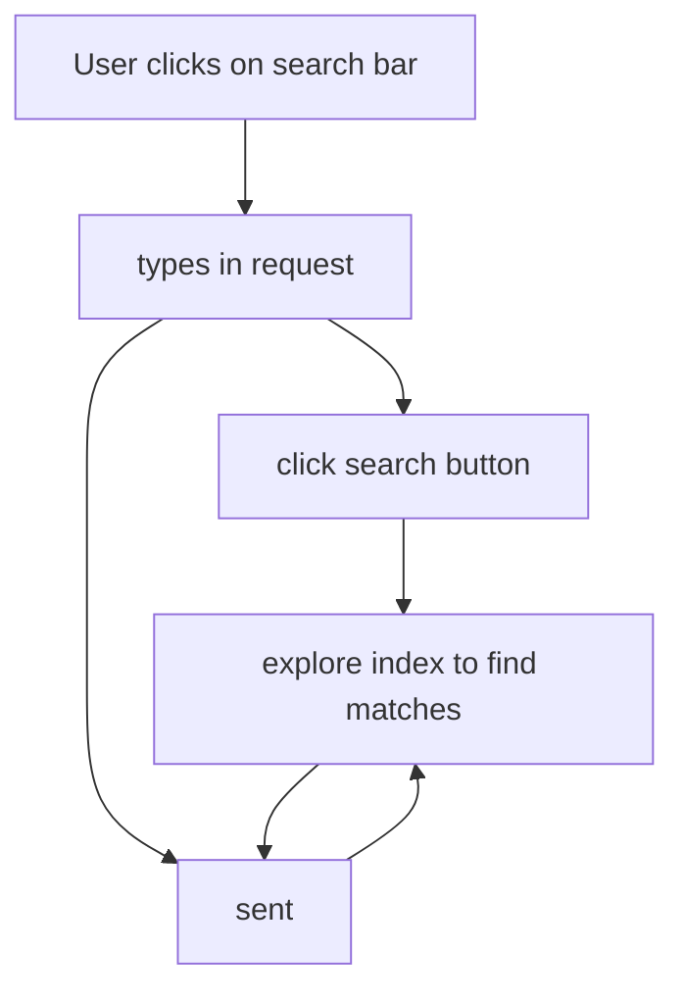

```mermaid
graph TD;
    A[User clicks on search bar] --> B[types in request];
    B[types in request] --> C[hit enter on keyboard];
    B[types in request] --> E[click search button];
    C[click search button] --> D[explore index to find matches];
    E[click search button] --> D[explore index to find matches];
    D[explore index to find matches] --> E[sent];
```
