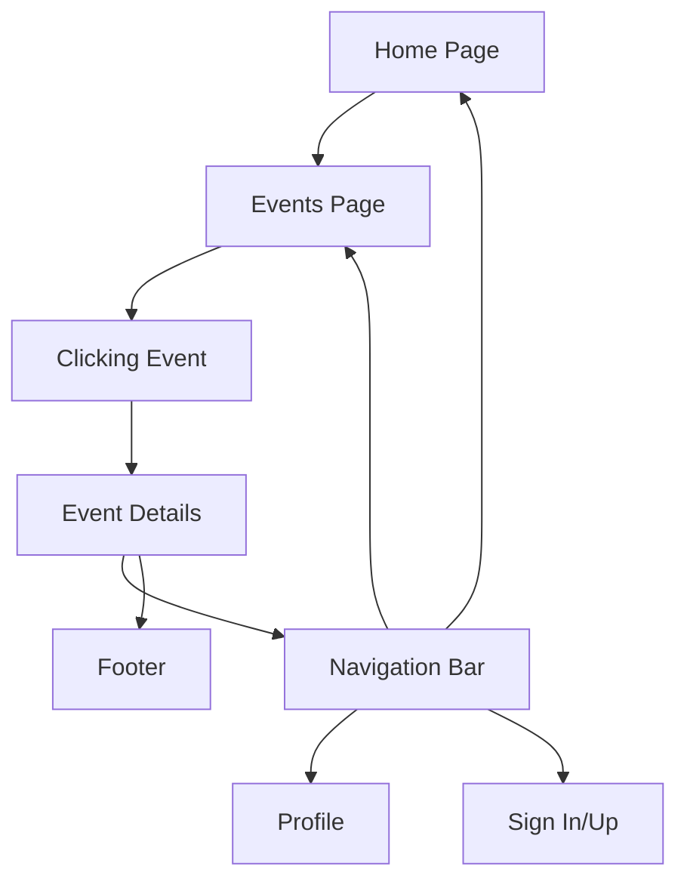

### Feature: Event Details
- **Description**: The event details page, which is accessed from clicking on specific events in the events tab. The event details page also includes the navigation bar and the footer which can access other parts of the website like the profile, sign up, and back to the events / homepage.
